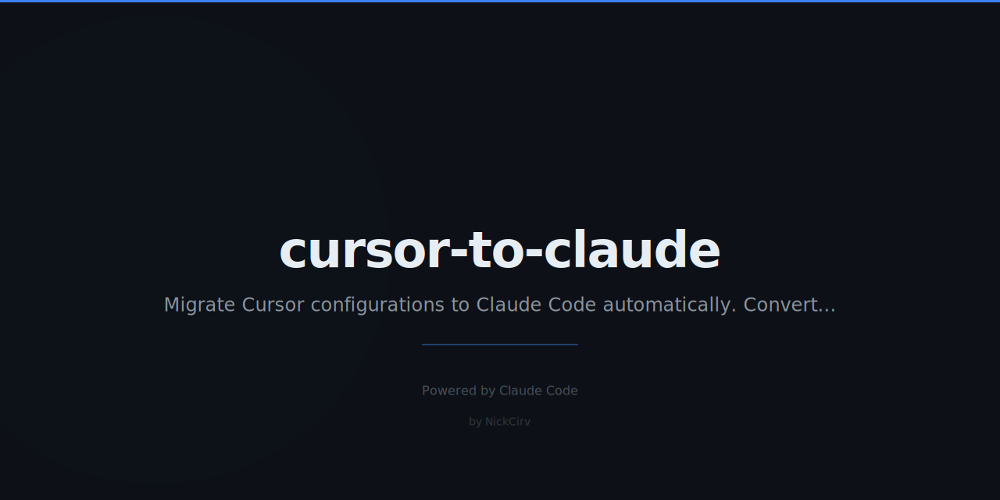

# cursor-to-claude

> The great migration. One command.

[](https://www.npmjs.com/package/cursor-to-claude)
[](LICENSE)
[](https://github.com/NickCirv/cursor-to-claude/stargazers)

---

## The Problem

You've got `.cursorrules`. Or `copilot-instructions.md`. Or `.windsurfrules`. You want to try Claude Code but you don't want to lose your setup — the rules you've spent months tuning, the ignore patterns, the project context. One command. Done.

---

## Quick Start

```bash
npx cursor-to-claude
```

No API key. No account. Pure file parsing. Run it in any project directory.

```bash
# Preview what will be created (dry run)
npx cursor-to-claude --dry-run

# Migrate a specific project
npx cursor-to-claude /path/to/project

# Skip confirmation prompt
npx cursor-to-claude --yes
```

---

## Example Output

```
cursor-to-claude — AI config migrator
──────────────────────────────────────

Scanning /Users/nick/my-app...

  Found: .cursorrules          (847 bytes)
  Found: .cursorignore         (312 bytes)
  Found: .cursor/rules/        (3 files)
  Found: copilot-instructions  (1.2 KB)

Creating Claude Code config...

  ✓ CLAUDE.md                          (1.4 KB)
  ✓ .claude/settings.json              (ignorePaths from .cursorignore)
  ✓ .claude/rules/cursor-migrated.md   (rules from .cursorrules)
  ✓ .claude/rules/copilot-migrated.md  (instructions from copilot)
  ✓ .claude/rules/cursor-context-1.md
  ✓ .claude/rules/cursor-context-2.md
  ✓ .claude/rules/cursor-context-3.md

──────────────────────────────────────
Done. Run `claude` to open Claude Code — your setup is live.
```

---

## Features

- Migrates `.cursorrules`, `.cursorignore`, `.cursor/rules/`, `copilot-instructions.md`, `.windsurfrules`, `.clinerules`, and `cline_docs/`
- Concept-level translation — "always use TypeScript" becomes a proper CLAUDE.md instruction, generic filler gets stripped
- `.cursorignore` becomes `ignorePaths` in `.claude/settings.json`
- Dry run mode — preview everything before writing a single file
- Diff mode — see the generated content before committing
- No API key, no Anthropic account, no network calls

---

## What Gets Created

```
your-project/
├── CLAUDE.md                        # Main instructions for Claude Code
└── .claude/
    ├── settings.json                # Ignore paths, permissions
    └── rules/
        ├── cursor-migrated.md       # Rules from .cursorrules
        ├── copilot-migrated.md      # Copilot instructions
        ├── windsurf-migrated.md     # Windsurf rules
        └── cline-context.md         # Cline project docs
```

`CLAUDE.md` is the primary file — Claude Code reads it at the start of every session. The `rules/` files load automatically and give you granular control per concern.

---

## How It Works

1. **Detect** — scans the target directory for all known AI tool config files
2. **Parse** — reads each file, extracts meaningful instructions (strips generic filler)
3. **Map** — applies concept-level translations (ignore paths → `ignorePaths`, rule sets → `rules/*.md`)
4. **Write** — outputs `CLAUDE.md` and `.claude/` structure with a summary of what was created

---

## Why We Switched

If you're coming from Cursor or Copilot, here's what changes:

| Cursor / Copilot | Claude Code |
|------------------|-------------|
| Tab completion with context | Reads the entire codebase, reasons about it |
| Sidebar chat | Agentic — runs commands, edits files, tests code |
| Per-file context | Project-wide context with memory |
| Rules file applied passively | CLAUDE.md actively guides every session |
| Autocomplete-first | Reasoning-first |

The mental model shift: you're not correcting autocomplete anymore. You're working with an engineer who has read all your code.

---

## Claude Code Config in 60 Seconds

**CLAUDE.md** — your main instruction file. Lives in project root. Gets read every session.

```markdown
## Code Style
- TypeScript everywhere, no `any`
- Functional React components only
- Zod for input validation at all boundaries

## Testing
- Write tests for all new code
- Jest + Testing Library
```

**.claude/rules/*.md** — modular rule sets loaded automatically. Separate concerns: `coding-style.md`, `testing.md`, `security.md`.

---

## Requirements

- Node.js 18+
- A project with at least one of: `.cursorrules`, `.cursorignore`, `.github/copilot-instructions.md`, `.windsurfrules`, `.clinerules`, `cline_docs/`

No API key required. No Anthropic account needed.

---

## See Also

- [ghost-mode](https://github.com/NickCirv/ghost-mode) — keep sensitive files out of Claude's context automatically
- [ai-code-roast](https://github.com/NickCirv/ai-code-roast) — get brutally honest feedback on your codebase
- [readme-surgeon](https://github.com/NickCirv/readme-surgeon) — brutal README feedback + auto-fix

---

## License

MIT — [NickCirv](https://github.com/NickCirv)

---

*Built by someone who made the switch and never looked back.*
