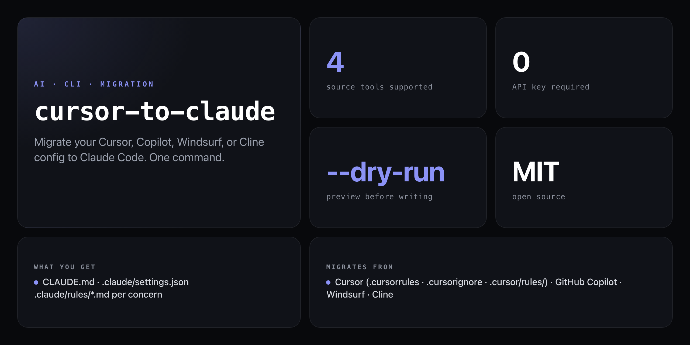

<div align="center">

**Your months of tuned rules, ignore patterns, and project context — moved to Claude Code in one command.**


</div>

---

You've got `.cursorrules`. Or `copilot-instructions.md`. Or `.windsurfrules`. You want to try Claude Code but you don't want to lose your setup — the rules you've spent months tuning, the ignore patterns, the project context. `cursor-to-claude` scans your project, parses every known AI tool config, and writes a proper Claude Code structure: `CLAUDE.md` + `.claude/rules/` + `.claude/settings.json`.

```
cursor-to-claude — AI config migrator
──────────────────────────────────────

Scanning /Users/nick/my-app...

  Found: .cursorrules          (847 bytes)
  Found: .cursorignore         (312 bytes)
  Found: .cursor/rules/        (3 files)
  Found: copilot-instructions  (1.2 KB)

Creating Claude Code config...

  ✓ CLAUDE.md                          (1.4 KB)
  ✓ .claude/settings.json              (ignorePaths from .cursorignore)
  ✓ .claude/rules/cursor-migrated.md   (rules from .cursorrules)
  ✓ .claude/rules/copilot-migrated.md  (instructions from copilot)
  ✓ .claude/rules/cursor-context-1.md
  ✓ .claude/rules/cursor-context-2.md
  ✓ .claude/rules/cursor-context-3.md

──────────────────────────────────────
Done. Run `claude` to open Claude Code — your setup is live.
```

## Install

No npm account needed — runs straight from GitHub:

```bash
npx github:NickCirv/cursor-to-claude
```

## Usage

```bash
# Migrate the current directory
npx github:NickCirv/cursor-to-claude

# Preview what will be created — no files written
npx github:NickCirv/cursor-to-claude --dry-run

# Show generated CLAUDE.md content before committing
npx github:NickCirv/cursor-to-claude --diff

# Migrate a specific project directory
npx github:NickCirv/cursor-to-claude /path/to/project

# Skip the confirmation prompt
npx github:NickCirv/cursor-to-claude --yes
```

| Flag | Description |
|------|-------------|
| `[dir]` | Project directory to migrate (default: current directory) |
| `--dry-run` | Show what would be created without writing any files |
| `--diff` | Show a preview of the generated CLAUDE.md content (implies `--dry-run`) |
| `--yes` | Skip the confirmation prompt and migrate immediately |

## What gets migrated

| Source | Config files detected |
|--------|-----------------------|
| **Cursor** | `.cursorrules`, `.cursorignore`, `.cursor/rules/` |
| **GitHub Copilot** | `.github/copilot-instructions.md` |
| **Windsurf** | `.windsurfrules` |
| **Cline** | `.clinerules`, `cline_docs/` |

Each source is parsed, stripped of generic filler, and written as a separate rules file so you keep granular control per concern.

## What gets created

```
your-project/
├── CLAUDE.md                        # Main instructions — read every Claude Code session
└── .claude/
    ├── settings.json                # Ignore paths from .cursorignore → ignorePaths
    └── rules/
        ├── cursor-migrated.md       # Rules from .cursorrules
        ├── copilot-migrated.md      # Copilot instructions
        ├── windsurf-migrated.md     # Windsurf rules
        └── cline-context.md         # Cline project docs
```

If `CLAUDE.md` or `.claude/settings.json` already exist, they are updated — not replaced.

## Why Claude Code is different

| Cursor / Copilot | Claude Code |
|------------------|-------------|
| Tab completion with local context | Reads the entire codebase, reasons about it |
| Sidebar chat | Agentic — runs commands, edits files, tests code |
| Per-file context | Project-wide context with memory |
| Rules file applied passively | CLAUDE.md actively guides every session |
| Autocomplete-first | Reasoning-first |

The mental model shift: you're not correcting autocomplete. You're working with an engineer who has read all your code.

## What it is NOT

- **Not a syntax converter.** It does a best-effort concept-level mapping — you should review the output `CLAUDE.md` and trim anything that doesn't make sense in Claude Code's model.
- **Not a network tool.** No API calls, no Anthropic account, no telemetry. Pure local file parsing.
- **Not a one-way street.** Your original config files are left untouched. Running the migration again with `--dry-run` shows any drift.

## Requirements

- Node.js 18+
- A project with at least one of: `.cursorrules`, `.cursorignore`, `.cursor/rules/`, `.github/copilot-instructions.md`, `.windsurfrules`, `.clinerules`, `cline_docs/`

---

<div align="center">
<sub>Node 18+ · MIT · by <a href="https://github.com/NickCirv">NickCirv</a></sub>
</div>
